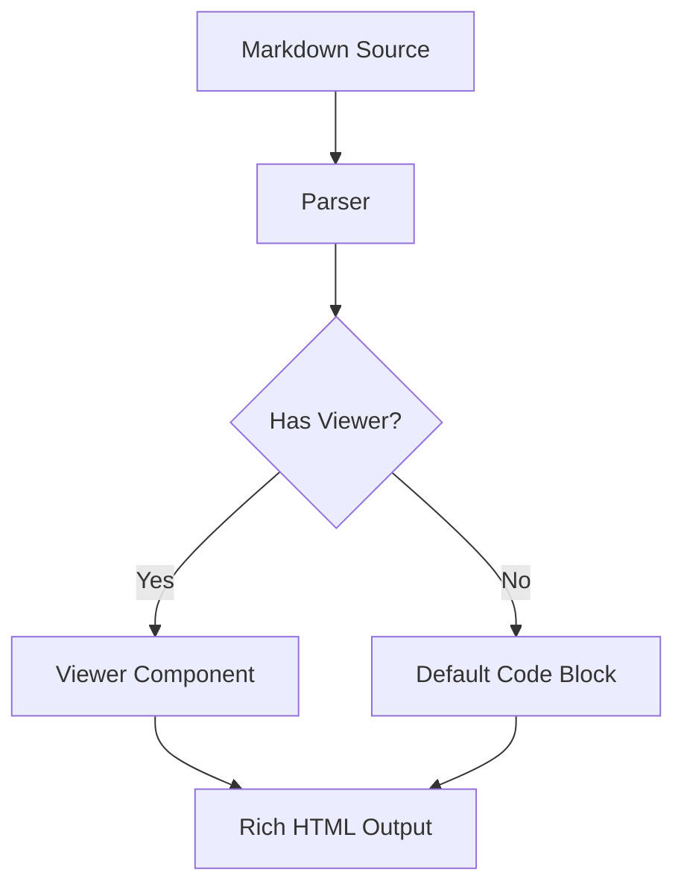

A [[dotlit]]-inspired extension: code blocks with special metadata are rendered by viewers instead of as plain code.

## CSV Tables

```csv !inline
Name,Role,Status
Alice,Engineer,Active
Bob,Designer,Active
Carol,Manager,On Leave
```

## JSON Data

```json !inline
{
  "name": "Garden",
  "type": "digital-garden",
  "features": ["wikilinks", "backlinks", "viewers"],
  "inspired_by": ["dotlit", "obsidian"]
}
```

## Mermaid Diagrams



## SVG Graphics

```svg !inline
<svg width="200" height="100" xmlns="http://www.w3.org/2000/svg">
  <rect width="200" height="100" fill="#fafafa" stroke="#e0e0e0"/>
  <circle cx="50" cy="50" r="30" fill="#e65100"/>
  <circle cx="100" cy="50" r="30" fill="#ff7a22"/>
  <circle cx="150" cy="50" r="30" fill="#ffab40"/>
</svg>
```

## Inline Markdown

```md !inline
This is **rendered markdown** inside a code block.

- Useful for documentation
- Can include [[wikilinks]] (though not processed here)
- Great for examples
```

## DSL Syntax

The code fence metadata DSL:

- `lang` - first position, determines viewer
- `filename` - second position, for output files
- `#tag` - adds CSS class `tag-xyz`
- `!directive` - controls rendering (`!inline`, `!collapse`)
- `attr=value` - arbitrary attributes (`viewer=custom`)
- `< path` - transclusion (read from file)
- `> lang` - output format

Example: `` ```csv data.csv #example !inline `` `

See [[literate-programming]] for the philosophy behind executable documents.
